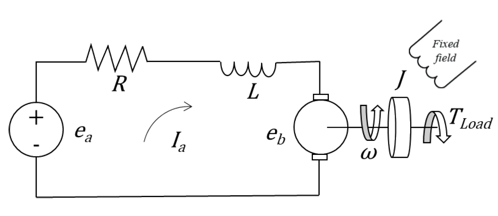

# DC Motor Control System
A DC servomotor has two main components, the first is the electrical part and the second is the mechanical part. It is simply represented as show by:

The equation which governs the electrical part is based on the Kirchhoff’s law given by:
$$\sum_{k=1}^{n}V_k=0$$
Where $V_k$ is the voltage, then the electrical part can be represented as follow:
$$L\frac{\partial I_a(t)}{\partial t} + RI_a(t) = e_a(t) - e_b(t)$$

where $R$ is the armature resistance, $L$ is the armature inductance, $I_a$ is the armature current, $e_a$ armature applied voltage, $e_b$ is the back electromotive force (emf) and $t$ is the time domain.

The equation which governs the mechanical part is based on the Newton’s law for rotational systems, given by:
$$T(t) - T_{load} = J\frac{\partial \omega(t)}{\partial t} + \eta\omega(t)$$

where $T$ is the torque, $T_{load}$ is the external load torque, $J$ is the moment of inertia, $\eta$ is the viscous friction coefficient, $\omega$ is the angular velocity and $t$ is the time domain.

The motor torque $T$ is related to armature current $I_a$ by the following equation:
$$T(t) = K_tI_a(t)$$

where $K_t$ is the torque constant. The *emf* $e_b$ is related to the angular velocity $\omega$ by the following equation:
$$e_b(t) = K_b\omega(t)$$

where $K_b$ is the back *emf* constant. 

## DC Motor State-Space Model
Considering a generic system as follow:

$$\begin{cases} \dot{x} = f(x,u,t)\\
y = g(x,u,t) \end{cases}$$

this system can be described by a set of equations of the form:

$$\begin{cases} \dot{x} = A(t)x(t) + B(t)u(t)\\ 
y(t) = C(t)x(t) + D(t)u(t) \end{cases}$$

where $x$ is the state vector, $u$ is the input vector, $y$ is the output vector, $A$ is the state matrix, $B$ is the input matrix, $C$ is the output matrix and $D$ is the feedthrough matrix.
The state-space model of the DC motor is given by:

$$\begin{bmatrix}\dot{I_a}\\
\dot{\omega}\end{bmatrix} = \begin{bmatrix} -R/L & -K_b/L \\ 
K_t/J & -\eta/J \end{bmatrix}\begin{bmatrix} I_a\\
\omega \end{bmatrix} + \begin{bmatrix} 1/L\\
0 \end{bmatrix}e_a$$

$$y(t) = \begin{bmatrix}0 & 1\end{bmatrix}\begin{bmatrix} I_a \\ \omega \end{bmatrix} + \begin{bmatrix}0\end{bmatrix}e_a$$

## DCMotor.py
The file `DCMotor.py` contains the class `dc_motor` which is used to create a DC motor object. The represents a DC motor and provides methods for simulating its behavior and retrieving simulation data.

## Control-sysnthesis.ipynb
Step by step control synthesis of the DC motor.

